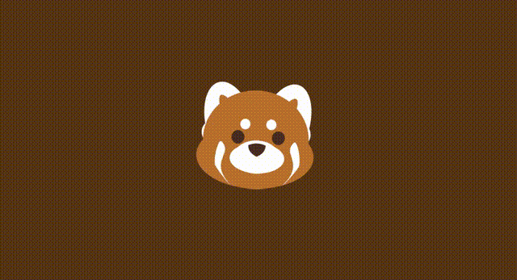

# Red Panda Morphing Animation 

> 一个纯前端实现的小熊猫交互动画。
> A pure CSS/SVG interactive animation inspired by Aha Workshop.

## 🌟 简介 

本项目使用纯 **HTML**、**CSS** 和 **SVG** 复刻了一个可爱的小熊猫转场动画。

灵感来源于 [Aha Workshop](https://www.ahaworkshop.com/) 的网页切换效果。原网站使用的是 MP4 视频素材。
* 本项目使用完全前端代码实现。

## ✨ SVG绘制

使用[Boxy SVG](https://boxy-svg.com/app)的在线可视化 SVG 编辑器

## 在此预览

https://ddanggui.github.io/Red-Panda-Morphing-Animation/

## 🤝 致谢 

* **灵感来源 (Inspiration)**: [Aha Workshop](https://www.google.com/url?sa=E&source=gmail&q=https://www.ahaworkshop.com/)
* 感谢原作者设计的可爱形象和动效创意。本项目是该效果的代码实现版本。
* *Special thanks to the original designers at Aha Workshop for the beautiful motion graphics concept. This project is a code-based recreation of their video effect.*

**Love from Redpanda ！⭐️**

